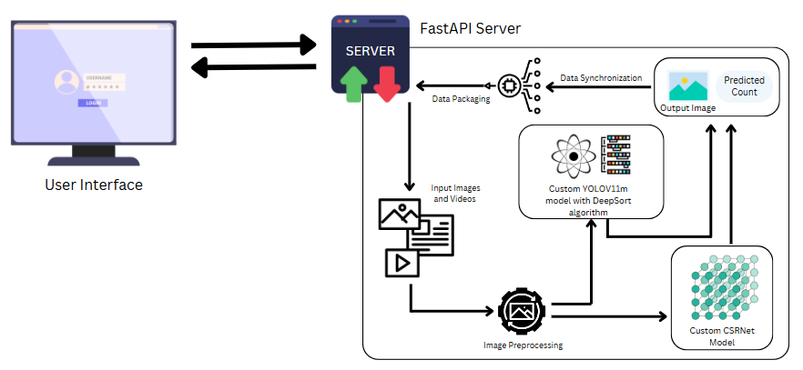
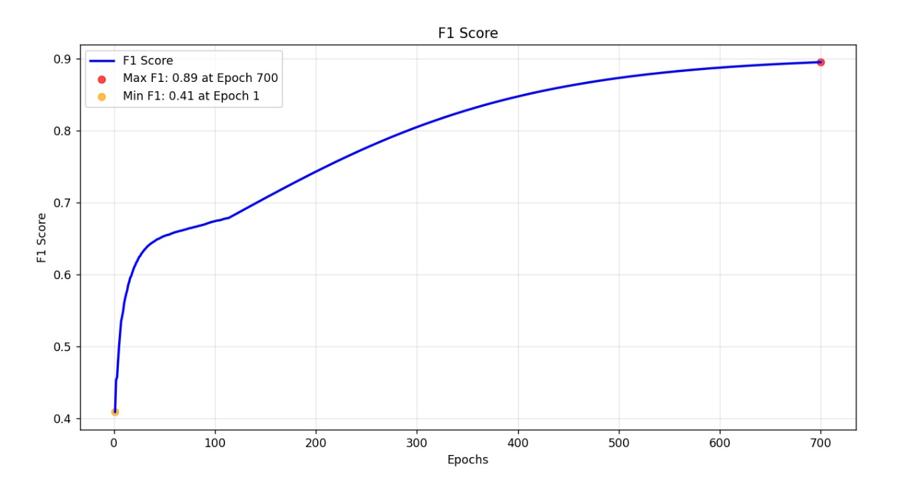
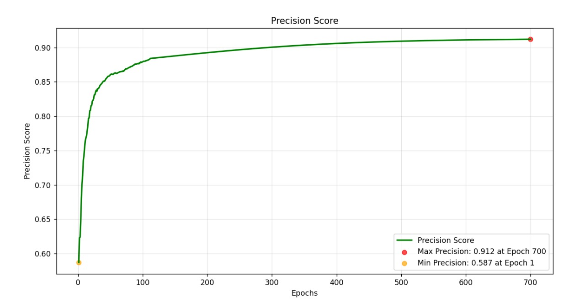
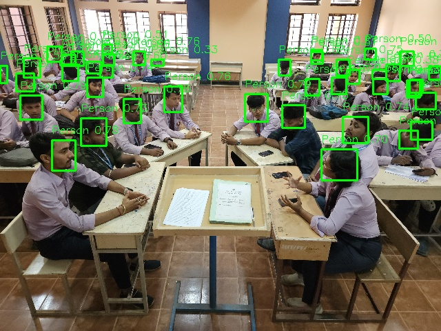
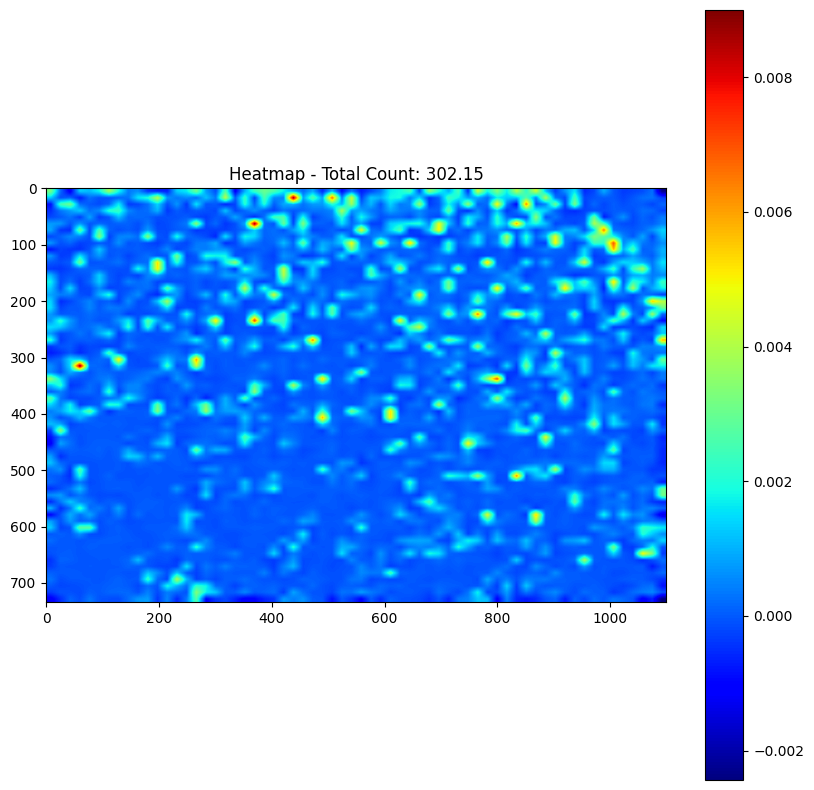
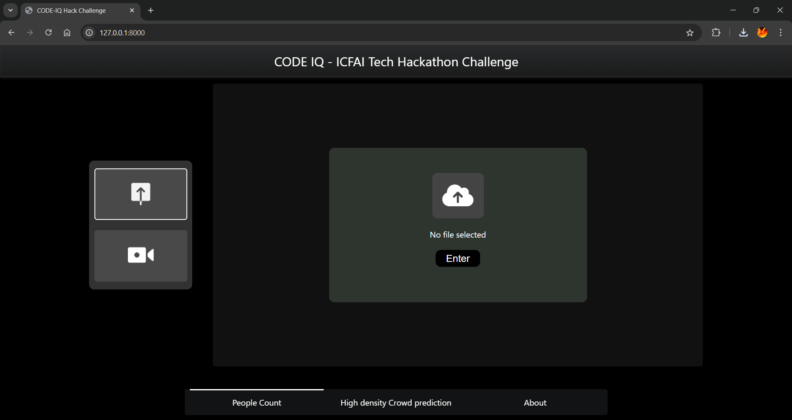
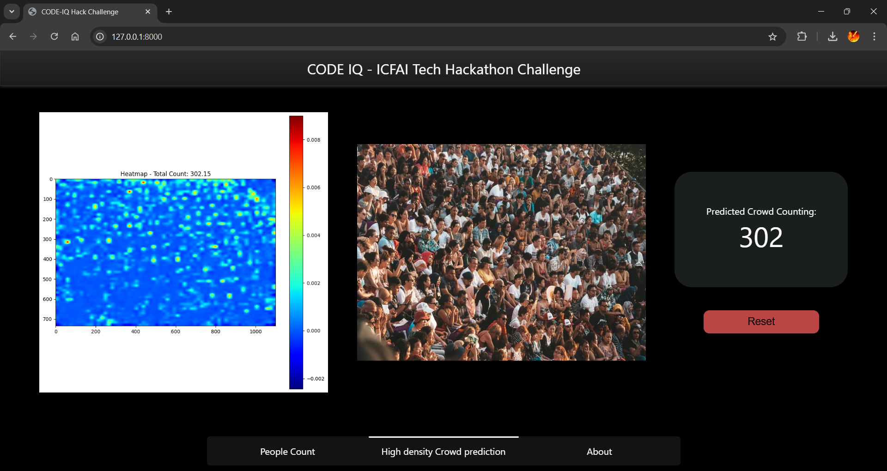

# CODE IQ - ICFAI TECH HACKATHON CHALLENGE
## SOLUTION BY TEAM CODE BLENDERS


## Table of contents

- [Overview](#overview)
- [Architecture Diagram](#my-process)
- [Built with](#built-with)
- [Installation](#installation)
- [Project structure](#structure)
- [Result Analysis](#resultanalysis)
- [Feature](#features)
- [Author](#author)


## Overview
- This is a solution to the [CODE IQ - ICFAI tech Hackathon Challenge (Track 1-2) ](https://unstop.com/hackathons/ml-core-icfai-tripura-1203996). 
- **Track 1: Crowd Counting** - Our model is designed to accurately estimate crowd sizes in images and videos, even under challenging conditions like varying densities, lighting, and diverse environments. We trained a deep learning model that detects and counts individuals efficiently by learning spatial and contextual cues within each frame.

- This project aims to develop an **accurate and adaptable crowd counting system** for **real-time monitoring and analysis**, addressing the need for reliable crowd size estimation in various scenarios. Our solution integrates a **Custom YOLOv11 model** for object detection and tracking with a **Custom CSRNet model** for density-based estimation. This dual-model approach ensures precise crowd size predictions across both **low-resolution sparse crowds and high-resolution dense crowds**. Hosted on a **FastAPI server**, the system supports **real-time video input via IP Webcam** and **batch processing of images and videos in multiple formats**, offering **high accuracy** and **adaptability** for diverse scenarios. It is designed to ensure **high usability** and **scalability** for applications in **public safety, event management, and urban planning**.

## Architecture Diagram



## Built with

- ### Frontend:
  - HTML, CSS, JS

- ### Backend:
  - FastAPI
  - Python
  - YOLOv11
  - Deepsort tracking algorithm
- ### Libraries
  - `Ultralytics`
  - `Opencv-python`
  - `numpy`, `pandas` for data handling
  - `uvicorn` for FastAPI

## Installation

### Prerequirements
  - `python3.11`

### Installation steps

  ```
    git clone https://github.com/Sabari2005/Code_iq
    cd Code_iq
  ```
  ```
  pip install -r requirements.txt
  ```

  - Execute each commands in a seperate terminal
  ```
  python index.py
  python serve.py

  ```
  - Open ` http://127.0.0.1:8000` in your browser

## Project structure

```
├──          
├── static
│   ├── css                    
│   └── images                 
├── templates
│   └── index.html             
├── index.py   
├── serve.py                           
├── requirements.txt           
└── README.md                  
```
## Result Analysis

- ### Crowd Counting 
     
    

- ### CustomCSRNet
    


## Sample model Output
- ### People counting
   
- ### CSRNet
  <div style="width:100%;height:500px;display:flex;gap:10px">
    
    
  </div>

## Website Overview

<div style="width:100%;height:500px;display:flex;gap:10px">


  </div>

## Features
- ### Our website have a real-time corwd prediction streaming

  - Install   ```IP webcam ``` in your android phone and click ```start server ```
  - Now enter the  ``` ipaddress``` and ``` port number ``` in the website 


## Demo 

- Click [here](https://drive.google.com/file/d/1IZmZjx_cvCxSVbB_x5qIh2awqWibaqm-/view?usp=sharing) to see the demo video

## DEMO

- Click [here](https://drive.google.com/file/d/1ZC1rX8M7_Ub9Awe_WQxNR36Gh07scK_X/view?usp=sharing) to see the demo video


## Author

- Sabari Vadivelan S (Team Leader) - Contact Gmail [sabari132005@gmail.com]()
- Kamal M (Member 1)
- Uvarajan D (Member 2)
- Kaviarasu K (Member 3)
